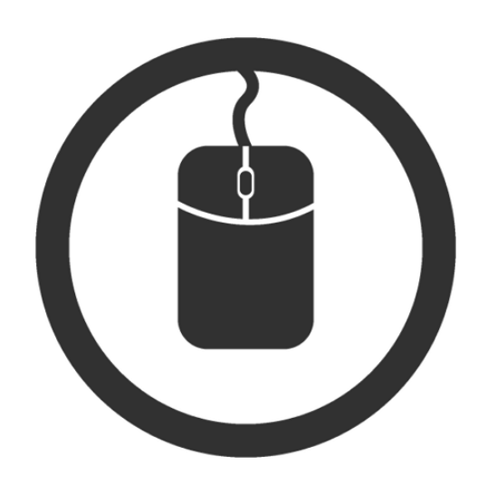

# MouseAI
- 인공지능을 활용한 마우스 자동완성 기능구현(광운대학교 2020년 1학기 참빛설계)
- 팀원 : 권나성, 김소민, 김수진, 이원빈

## 프로젝트 수행 배경
- 현재 과도한 마우스 사용으로 손목 터널 증후군을 앓는 인구가 증가함
- 마우스 사용이 많이 요구되는 간단한 단순 업무의 경우, 마우스 움직임을 자동화하여 손목의 물리적인 사용을 줄이는 것을 목표로 함
- 마우스의 속도 증가량(속도 미분값)을 이용하여 학습 패턴의 핵심 메커니즘을 작성함

마우스를 움직일 때, 우리는 등속 운동이 아닌 가속 운동으로 움직임
0.01초(파라미터를 조정하며 이를 조절할 수 있음) 단위로 마우스 위치가 얼마나 바뀌는지 확인을 거치면 속도를 알 수 있게 됨
위의 그래프와 같은 마우스 시간-속도 그래프를 그려봤을 때 예상한 모양이며, 완벽한 2차원 곡선이 아닌 초기에만 빠른 속도를 나타내었다가 갈수록 느려지는 모양으로 나타남
가장 높은 속도를 나타내는 정점일 때, 확실히 그쪽으로 가려는 움직임을 보일 것이고 방향이 정해질 것이고 속도가 제일 빠를 때 방향이 정해지며 거리상 측면으로 봤을 때 거리가 멀면 속도가 빠르고 거리가 짧으면 속도가 느려짐(미세 컨트롤 기능이 필요한 경우)
이와 같은 가설로 미루어 보아, 속도를 통해 남은 거리를 예상할 수 있음

## 데이터 수집 프로그램
: 현재 마우스 좌표 데이터가 대량으로 수집된 데이터는 없음 - 직접 수집해야 함

데이터 수집 프로그램의 원리는 다음과 같다.

- 데이터를 수집하기 위한 또 하나의 작은 자동완성 프로그램
- 위와 같은 양식으로 UI를 구성[색깔을 포함한 UI가 들어가면 프로그램 코드가 너무 복잡해지고 조잡해져서, 각 공간에 숫자를 명시하도록 구성]
- 특정 순서를 임의로 정해, Start 버튼을 누른 후 해당 순서대로 버튼을 눌러 Start 버튼을 누르고 나서부터 각 순서대로 버튼을 누르기까지 0.01초 단위의 좌표를 엑셀로 저장하여 구성된 데이터셋을 마련함
- 처음에 버튼을 몇 개 구성할건지 숫자를 입력하고 해당 숫자X해당 숫자만큼의 버튼이 생성됨
- 전체 UI의 크기는 일정하므로 버튼의 개수가 많을수록 버튼 1개의 크기는 작아지며 미세 컨트롤이 필요한 상황까지 고려할 수 있음

* 이미 데이터셋은 학습하기 충분할 만큼으로 구축되었음[수동 작업] : 만약 더 많은 데이터셋의 구축에 대한 필요성이 요구될 경우, 데이터 수집 프로그램을 실행하면 됨
- AutoMouseAI_LKMOUSE_Project 폴더에 있는 final_LKMouse.ipynb를 실행해주세요.
- 이에 대해 수집된 데이터는, x_data_final.xls, y_data_final.xls, speed_data_final.xls 파일로 저장됨
- 데이터는 총 3가지, X좌표, Y좌표, 속도 좌표로 구성됨

## 학습 모델
LSTM을 사용하였습니다.
: 마우스 좌표 데이터는 시계열 데이터, 앞 부분의 데이터에 대한 정보가 사라지는 Gradient Vanishing 문제도 최대한 피해야 함

## 시연영상

## 라이브러리 설치

### anaconda prompt창에서 아래 라이브러리를 설치해주세요.

- pip install PyQt5
- pip install tensorflow
- pip install keras
- pip install pyautogui
- pip install numpy

## 프로젝트 실행
- AutoMouseAI_LKMOUSE_Project 폴더에 있는 AutoMouseAI_LKMouse.ipynb 를 실행해주세요.
- 작은 Demo 프로그램으로서, 자주 사용하는 사이트 아이콘을 추가하여 UI를 구성함
- 위에서 수집한 데이터를 바탕으로 구축된 LSTM을, 새로이 구축한 UI에 적용함
- Start 버튼을 누르고 약 0.5초 정도 방향성만 지정할 수 있도록 마우스를 잠깐 움직여주고 떼면, 이를 바탕으로 다음 좌표값을 예측해 자동으로 아이콘을 클릭하여 사이트에 접속할 수 있도록 함
